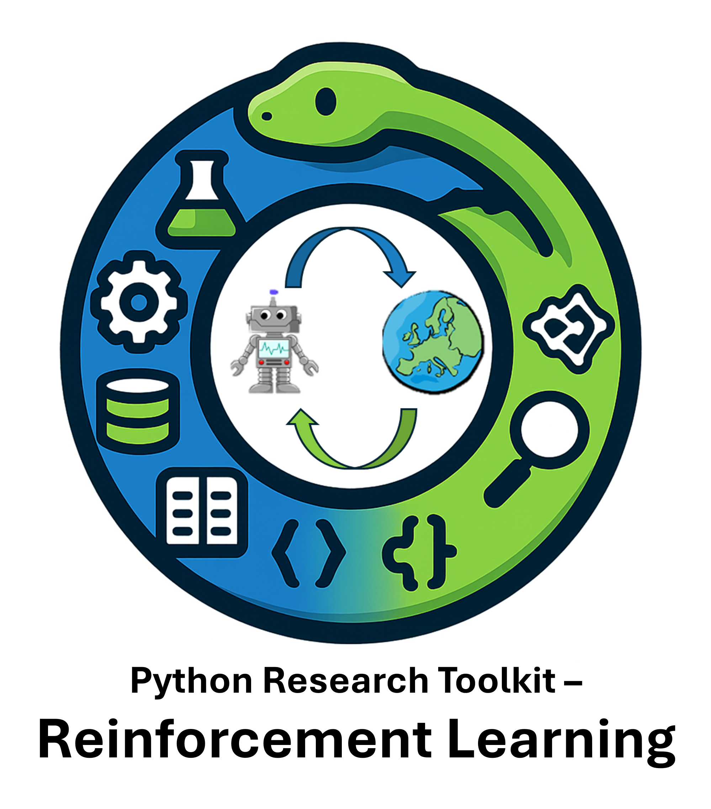

..
   Note: Items in this toctree form the top-level navigation. See `api.rst` for the `autosummary` directive, and for why `api.rst` isn't called directly.

.. toctree::
    :maxdepth: 1
    :hidden:
    :caption: Notes

    source/dynamic-programming.md

.. toctree::
   :hidden:
   :caption: API Reference

	prt_rl <_autosummary/prt_rl>
    prt_sim <_autosummary/prt_sim>

.. include:: source/home-page.md
   :parser: myst_parser.sphinx_